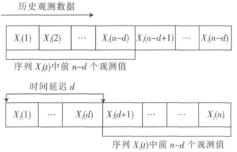

## 特征工程

### 基于时空语义的短时交通流建模

​	文章在统计学**相关系数**的基础上,对其进行时空语义的扩展,引 入了**空间权重矩阵**与**时间延迟**以表达各流量序 列间的时空关联性. 并以时空相关系数为判断 依据,快速选取与预测点相关的预测因子,最后 以支持**向量机**为预测工具,提出了一种基于时空分析的短时交通流量预测方法. 

#### 1. 理论概念

符号说明

| 变量名 | 解释说明                    |
| ------ | --------------------------- |
| S      | 空间单元（路口/路段），N个  |
| X      | 时空属性序列（车流量），n个 |

**时间延迟$d$**

​	如下图，$X_i = <x_i(1),x_i(2),...,x_i(n)$>表示空间单元$i$的车流量序列，共n个时段。**超参**时间延迟$d$指时段间隔。

**时空权重矩阵P**

​	P表示空间单位个数$N=n$、超参时间延迟$d=D$，路段$i$的空间权值矩阵。横向为空间维度、纵向是时间维度。
$$
P =\left| 
\begin{array}{lcr}
\rho_{i1}(0) & \rho_{i2}(0) & \ldots & \rho_{in}(0) \\
\rho_{i1}(1) & \rho_{i2}(1) & \ldots & \rho_{in}(1) \\
\ldots  & \ldots  & \ldots  & \ldots  \\
\rho_{i1}(D) & \rho_{i2}(D) & \ldots & \rho_{in}(D) \\
\end{array}
\right|
$$
**时间权重系数$\rho_{ij}$**计算公式
$$
\rho_{ij}(d) = w_{ij}\frac{\sum_{t=1}^{n-d}[x_i(t+d)-\bar x_i(d-n)][x_j(t)-\bar x_j(n-d) ]}{\sqrt{\sum_{t=1}^{n-d}[x_i(t+d)-\bar x_i(d-n)]^2\sum_{t=1}^{n-d}[x_j(t)-\bar x_j(n-d) ]^2}}
$$

#### 2. 流程

​	总体流程图如下所示，主要有两步，一是用时空分析算法进行特征工程，二是用最大最小归一化方法对目标工程。

